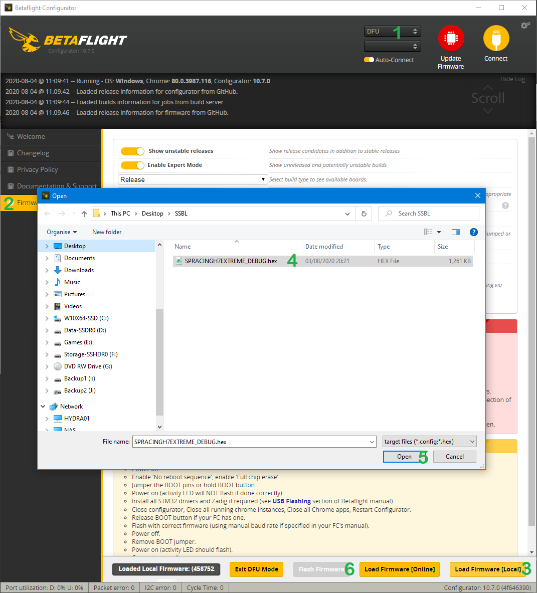
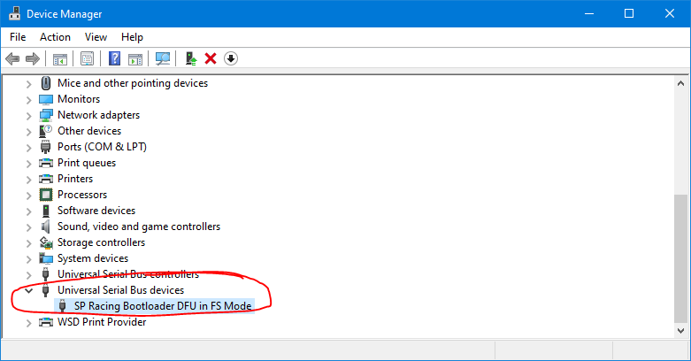
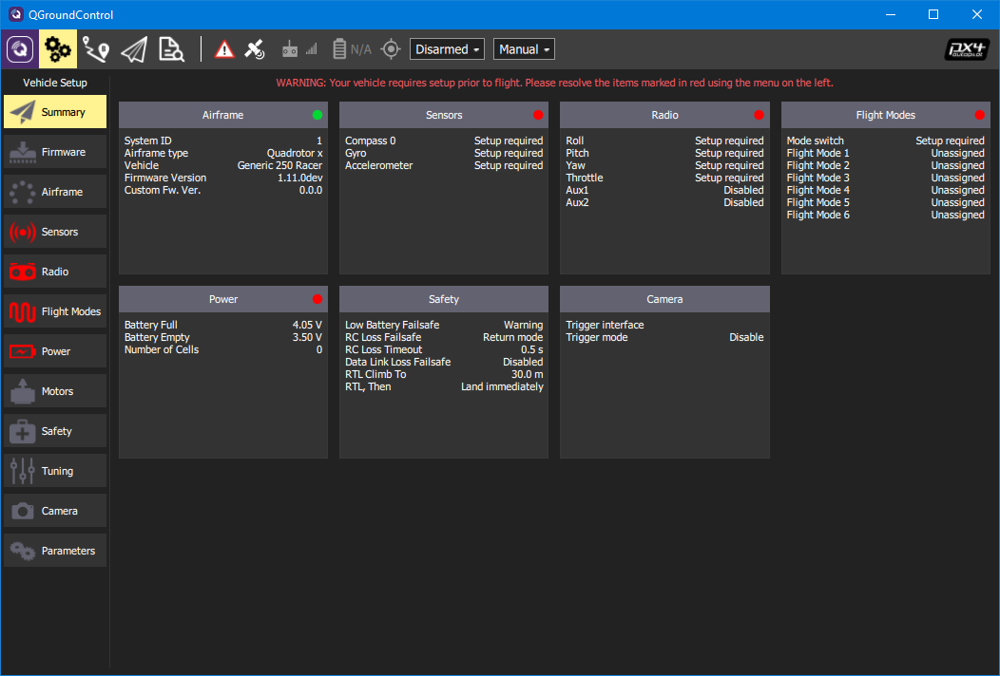

# SSBL - Second Stage boot loader

The SSBL is an open-source second stage bootloader which provides advanced boot functionality for the SP Racing H7 series flight controllers.  For example, to boot Flight Control software which is larger than the 448K default, such as PX4.

* Why?

The SPRacing H7 series flight controllers (H7EXTREME, H7ZERO, H7NANO) use the H750 CPU which has excellent performance but very limited internal flash space.  The H7 FC's use the internal flash for a bootloader which copies a program from external flash or SD card into memory, and then the program runs from memory instead of internal flash.  The program is limited to a maximum size, 448K, which is fine for Cleanflight/Betaflight as it fits in that space.  However, for larger auto-pilot systems and/or ones which have advanced navigation capabilites, such as PX4 and Ardupilot, 448K is not enough.

* How?

The SSBL takes the place of the regular program and allows the flight controller to use supported external flash chips as memory from which code can be run, instead of copying the code to RAM before running it.  This allows for a) much larger programs on the external flash, and b) allows the program to use the 448k of RAM which would otherwise contain the program itself.

IMPORTANT: See [Supported](#Supported-flash-chips) and [Unsupported](#Unsupported-flash-chips) flash chips.

# Supported flight controllers

* SPRacingH7EXTREME PX4 Edition - https://shop.seriouslypro.com/sp-racing-h7-extreme (make sure to select PX4 Edition when purchasing).

# Supported flash chips

The SSBL currently supports the following flash chips:

* [W25Q128](https://www.winbond.com/hq/product/code-storage-flash-memory/serial-nor-flash/?__locale=en&partNo=W25Q128JV) (W25Q128JVEIQ/W25Q128JVEJQ)

Support for other flash chips is possible, but requires SP Racing bootloader *and* SSBL support, as the SP Racing bootloader must be able to boot the SSBL.

# Unsupported flash chips

* [W25N01GV](https://www.winbond.com/hq/product/code-storage-flash-memory/qspinand-flash/index.html?__locale=en&partNo=W25N01GV) (Does not support QSPI Memory Mapped Mode)
* Everything else not listed as supported.

Important: The SPRacing H7 series FCs using the W25N01 flash chip are *NOT* supported. You NEED the PX4 edition and the PX4 edition bootloader.  If you want to have the flash chip replaced on a non-PX4 board contact SP Racing via the contact-us page on the shop site. 7.50EUR fitting + return postage.

Technically you could replace your W25N01 with a W25Q128 and install the SSBL to SD card and boot from SD card, if you feel inclined.


# Running the SSBL.

The SSBL is run the same way any other firmware is run by the bootloader.  Usually the SP Racing Bootloader will run firmware from External Flash, but can also run firmware from SD card without installing it to external flash.

## Running from External Flash

* Follow the installation in the Installation section below.
* Power on the FC.

Note: if you're using an SD card make sure it doesn't have a file called `CFEXSTFW.BIN` on it.

## Running from SD Card

If your FC has a MicroSD card socket then `.bin` file can be renamed to `CFEXSTFW.BIN` and place on the MicroSD card, the SP Racing bootloader will always try booting from SD card first before External Flash.
This allows you to leave your existing firmware on the External Flash.

# Installation

## Installation to External Flash

Since the SSBL is simply just an EXST firmware file it can be flashed using any tool that can flash existing EXST firmware.  E.g. Cleanflight/Betaflight configurator.

### Via CF/BF configurator.

* Place FC in SB Racing Bootloader mode - power off, hold BIND (not BOOT), power on - LED flashes fast, release BIND, LED flashes slow - DFU mode enabled.  OR use CF/BF `bl flash` CLI command.
* Ensure DFU appears where the COM PORT selection is usually displayed.  You may need to install DFU drivers, see CF/BF docs/wiki.
* Click "Firmware Flasher"
* Click "Load Firmware [Local]"
* Open the .hex file for the SSBL, e.g. "SSBL_SPRACINGH7EXTREME_RELEASE.hex"
* Click "Flash Firmware".



### Installation via DFU.

* Place FC in SB Racing Bootloader mode - power off, hold BIND (not BOOT), power on - LED flashes fast, release BIND, LED flashes slow - DFU mode enabled.  OR use CF/BF `bl flash` CLI command.
* Ensure device manager shows the FC as below:

* Flash the SSBL binary to the last 448K of the External Flash chip using `dfu-util` (assumes 16MB flash chip).
```
dfu-util -D build/SSBL_SPRACINGH7EXTREME_RELEASE.bin -s 0x90F90000:0x70000
```
* Power off and on.

### Installation via SD card.

Also, it's possible to copy the file from the SD card to the External Flash using the SP Racing Bootloader.  See https://github.com/spracing/betaflight/issues/1 "Firmware upgrade procedure via SD card".  Use the `.bin` file for the SSBL instead of the `.bin` file for Betaflight/Cleanflight.

## Operation

The SSBL runs very quickly, it should just enable the LED and launch the installed firmware on the External Flash.  

However, if the firmware doesn't boot then SSBL has a feature to provide error reporting if things are bad.  Errors are reported using an LED.  The LED will flash very fast 20 times. Then it will flash slowly, count the slow flashes to get the 'blink code'.

| Blink code | Meaning                               |
| -----------| ------------------------------------- |
| 1          | Developer error                       |
| 2          | External Flash not detected/supported |
| 3          | Firmware invalid                      |

# Interoperability

Since each flight control firmware is responsible for it's own configuration storage and additional use of External Flash you may find that one flight controller firmware will overwrite data used by another one.  This is a current limitation of each respective flight control software and the respective project's time and willingness to provide interoperability.  For instance, CF/BF/PX4 all use the same section of External Flash dedicated to storing configuration.  PX4 uses a portion of the external flash for firmware while CF/BF will use the external flash for black-box logging.

Also, for developers, it's technically possible to add support for partitions on the external flash and have each FC system be aware of such partitions and provide a boot choice system without using the SD card dual boot system (below).  For instance GPT partioning could be used on the external flash.  Some space at the beginning of the external flash has been reserved for this already.

## Dual boot

It's already possible to dual boot the SP Racing FC's with different firmware so you can try out and use different firmware on your aircraft and you can use the SSBL with this existing dual-boot system.

## Dual boot usage for CF/BF and PX4.

It's possible to compile Cleanflight/Betaflight to use SD card for logging, configuration and firmware, so you can place CF/BF on an SD card and it won't overwrite the external flash.  So - insert CF/BF SD card - fly CF/BF.  Remove SD card, fly PX4.

1. Install CF/BF toolchain.
2. Compile CF/BF - Edit `src/main/target/SPRACINGH7EXTREME/target.h`

change:

```
#define CONFIG_IN_EXTERNAL_FLASH
//#define CONFIG_IN_SDCARD
```

to

```
//#define CONFIG_IN_EXTERNAL_FLASH
#define CONFIG_IN_SDCARD
```

3. Build the firmware
```
make TARGET=SPRACINGH7EXTREME
```

4. Format your SD card using the SD Association SD card formatter tool - https://www.sdcard.org/downloads/formatter/)
5. Copy it to your SD card (where `U:` is your SD card)

```
copy obj/betaflight_4.x.x_SPRACINGH7EXTREME.bin U:\CFEXSTFW.BIN
```

6. Insert SD card into FC, boot FC running CF/BF.
7. Change blackbox logging to log to SD CARD instead of External Flash.

For further details/help regarding toolchain installation and compiling firmware refer to each project's documentation sources and/or developer chat rooms.


8. Install PX4 to External Flash as normal, see PX4 installation section.
9. Done!  To Fly CF/BF use the SD card and boot, to Fly PX4 remove the SD card and boot.


# PX4 Installation to External Flash

Install the SSBL first, see above.

## SP Racing H7 EXTREME PX4 Edition.

* Place FC in SB Racing Bootloader mode - power off, hold BIND (not BOOT), power on - LED flashes fast, release BIND, LED flashed slow - DFU mode enabled.  OR use CF/BF `bl flash` CLI command.
* Ensure an DFU device is detected and install ST DFU drivers as required.


* Get a PX4 binary for the FC.  The example below assumes you have a non-padded file called PX4.bin, if it's already padded and exactly 2097152 bytes long skip the next step.

* Use `dd` to pad the binary, or you can create an empty file exactly 2MB long (1024 * 1024 * 2 = 2097152 bytes) and copy the PX4.bin content to the start of it using your tool of choice, save it as `PX4_2MB.bin`
```
dd if=/dev/zero ibs=1k count=2048 of=PX4_2MB.bin
dd conv=notrunc if=PX4.bin of=PX4_2MB.bin
```

* Flash the binary using dfu-util.

```
dfu-util -D PX4_2MB.bin -s 0x90100000:0x200000
```
Note: The 0x90100000 is the address that PX4 is built to run from, which is an address for the external flash that the SP Racing Bootloader exposes via DFU.

* Verify the flash.  The `dfu-util` command below copies the contents of the flash back to the computer, the `diff` command will tell you if the contents are identical or different.  Do not attempt to fly if `diff` doesn't say the files are identical - retry.

``` 
dfu-util -U PX4_2MB-VERIFY.bin -s 0x90100000:0x200000
diff -sb PX4_2MB.bin PX4_2MB-VERIFY.bin
```

* Power off, make sure that the SSBL is installed (either to SD card or to external flash), power on and use QGroundControl to configure the FC as normal.

Note: The above assumes the PX4 binary should be 2MB, if PX4 grows then adjust the `2048` and `0x200000` values above to suit larger firmware.



# Removal of the SSBL.

To remove the SSBL, place the FC in SP Racing Bootloader mode and flash any firmware (e.g. CF/bF) as normal.

# Developers

## Building

```
make TARGET=SPRACINGH7EXTREME
```

the `.bin`/`.hex` files appear in `build`.

## Boot process

* MCU reset
* MCU checks boot option registers (Flash is default)
* SP Racing boot loader in MCU Flash loads the SSBL EXST firmware from SD card (first) or external flash into RAM.
* Second Stage Boot Loader (SSBL) runs from RAM.
* SSBL checks for supported flash chip, enables QSPI memory mapped mode and launches firmware (e.g. PX4) from external flash, and all RAM used by SPRacing Bootloader and SSBL is available for use again.

Note: The SSBL currently a checks to see if the stack address is located in main ram (0x24xxxxxx) before it will boot.  See source for details.

## External Flash Layout (16MB flash chip)

The W25Q128 flash chip is currently used, and it has minumum erasable size of 4KB (1 sector) and maximum erasable size of 64KB (block erase, as used by CF/BF).

The first 3 64KB erasable blocks are reserved for paritioning usage, e.g. using GPT.
The next block is not MB aligned so it's currently unused.
The SSBL runs firmware (e.g. PX4) from the 0x90100000 onwards.
The last 512KB is used for firmware config (64KB) and the SSBL itself (448KB).

```
0x90000000-0x90000fff (4KB) Reserved for flash Layout and boot choice.  e.g. via GPT.
0x90001000-0x9002ffff (188KB) Reserved (partitioning/etc). e.g. for GPT.
0x90030000-0x900fffff (828KB) (1024-188-4) Unused/Empty
0x90100000-0x902fffff (2MB) PX4 Firmware.
0x90300000-0x90f7ffff (12.5MB) Unused/Empty
0x90f80000-0x90f8ffff (64KB) - PX4 Config/Bootloader erasable 'config' partition.
0x90f90000-0x90ffffff (448KB) - BF/iNAV/Second stage bootloader/etc.
```

# Acknowledgements

* Igor Mišić for adding SPRacingH7EXTREME PX4 support - https://github.com/PX4/Firmware/pull/15385
 
